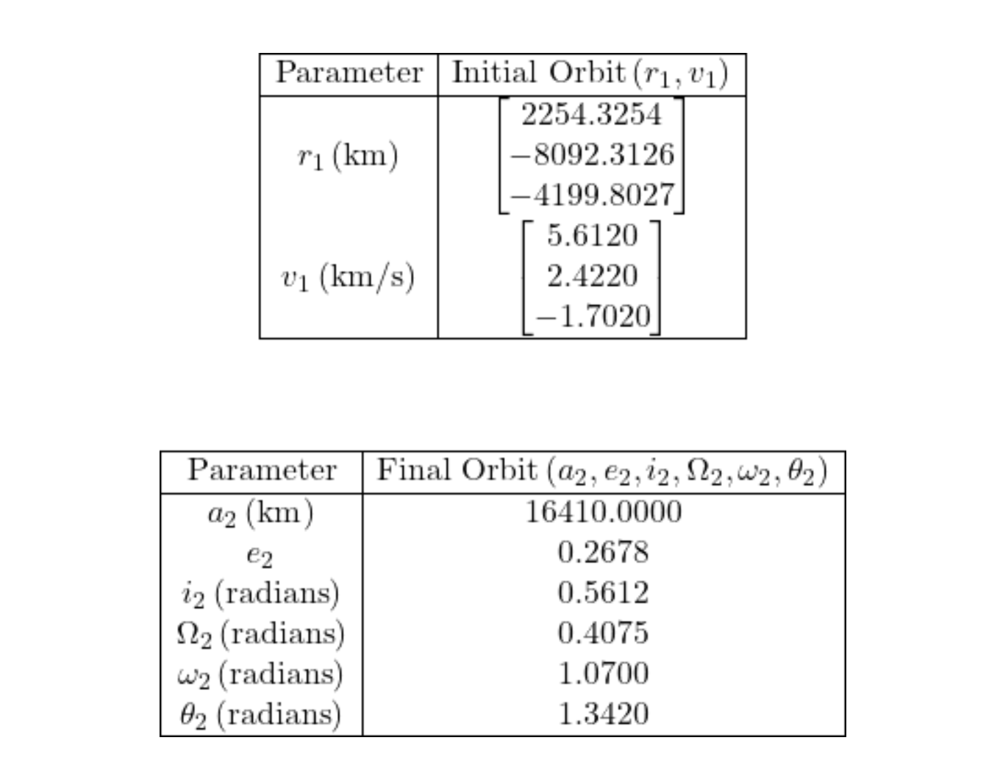
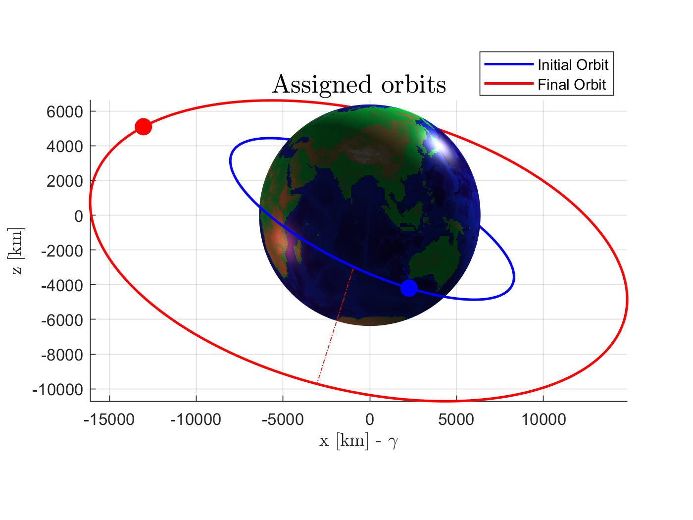
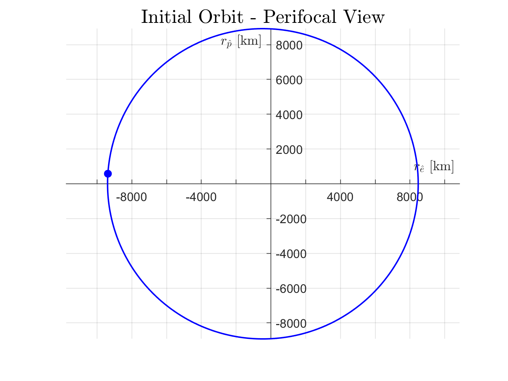
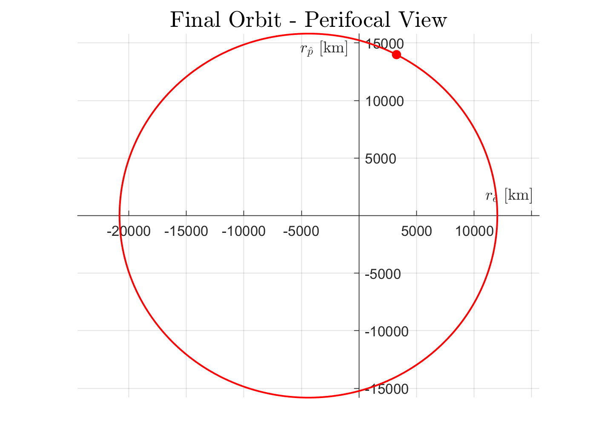
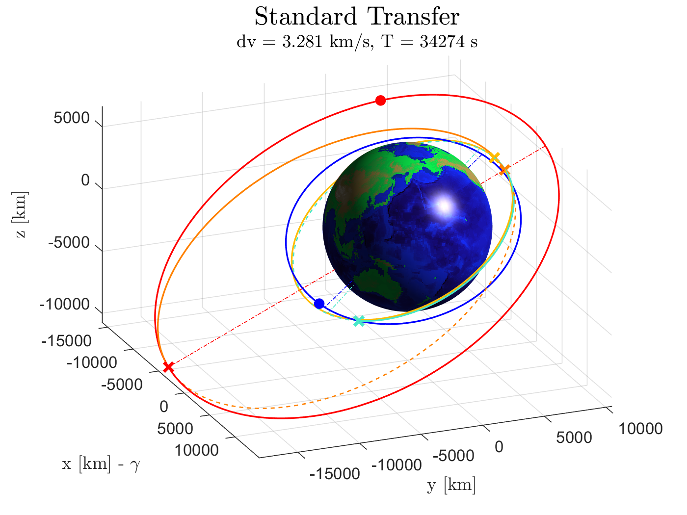
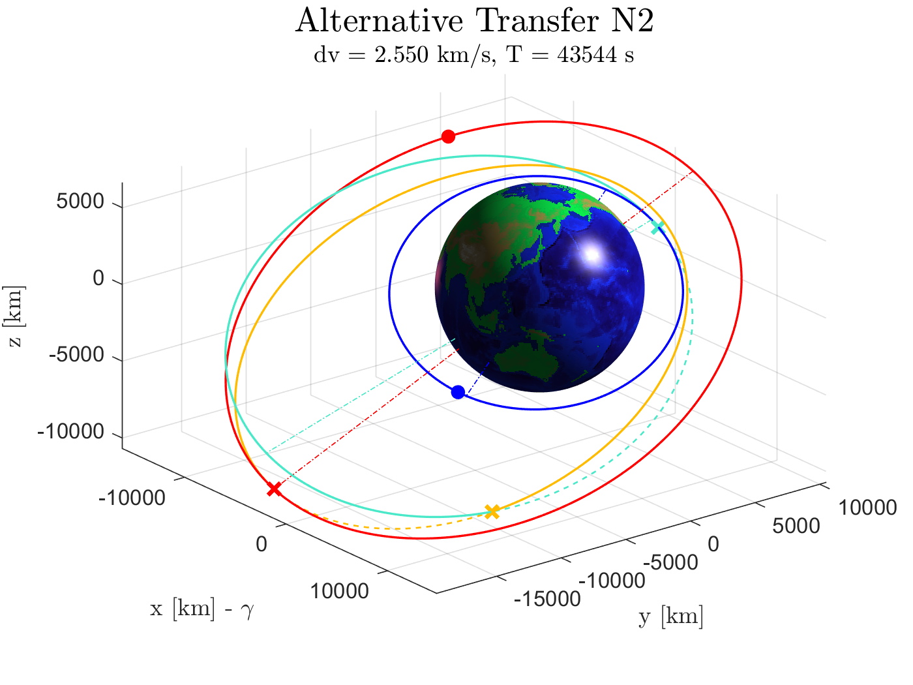
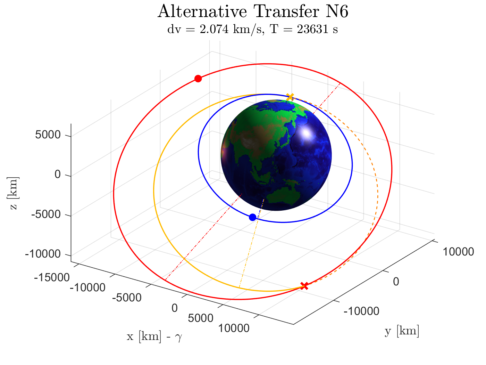

# Orbital Mechanics: Optimizing Satellite Transfers

_How to efficiently transfer a satellite between two orbits?_

## Objective
The goal is to transfer a satellite from an initial orbit to a final orbit, identified by the following orbital parameters:

  

The challenge is to optimize the transfer using impulsive burns by minimizing the required **delta-v** and transit time. The project explores the standard Hohmann transfer with periapsis and plane change maneuvers and **six additional transfer methods** to improve efficiency.

---

## Initial Orbit Visualization
Below are some plots showing the initial orbital conditions:

  
  
  

---

## Example Transfers
Here are examples of different transfer methods, including the standard and additional proposed techniques:

  
  
  

---

## Optimization Approach
The transfer optimization is based on:
- **Delta-v minimization**: Reducing the total velocity change required.
- **Time minimization**: Balancing fuel efficiency with transit time.

---

Feel free to explore the details of the transfer methods, code, and simulations in the repository!
